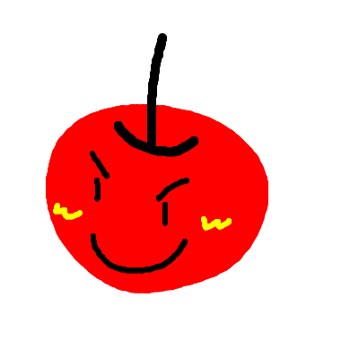

## Intro

This blog uses [Hugo](https://gohugo.io/), a static site generator, and the theme is [PaperMod](https://github.com/adityatelange/hugo-PaperMod/).  
I use [GitHub Pages](https://pages.github.com/) for the hosting service.  
For the sake of notes and introduction, I write down some of the tweaks I made.  
At first, the motto was KISS, but the tweaking became bloated before long.  
The code became bloated, but the output was designed to be lightweight. (No unnecessary CSS loading, etc.).  
This blog is designed to look correct even if JavaScript is disabled. ( for privacy nerds like me :) )  
Also, all scripts are downloaded by Makefile and no CDN is used.  
The repository for this blog is [https://github.com/HidegonSan/blog/](https://github.com/HidegonSan/blog/).  
Thanks and Open Source License: [https://hidegonsan.github.io/blog/pages/thanks/](https://hidegonsan.github.io/blog/pages/thanks/)  

## Shortcodes

### Alert

Our very own Aditya thinks that a monochrome theme is appropriate for PaperMod, so I followed his lead.  
The [Tabler Icon](https://tabler-icons.io/) is used for the svg.  
Tabler Icon's license: MIT  

Usage:  

```

**Note** or **Alert** or **Danger**  
Here is the text...

```

Sample:  


**Note** or **Alert** or **Danger**  
Here is the text...



**Tip** or **Hint**  
Here is the text...



**Important** or **Info**  
Here is the text...



**Caution** or **Failure** or **X** or **NG**  
Here is the text...



**Warning**  
Here is the text...



**Help** or **Question**  
Here is the text...



**Check** or **Success** or **OK**  
Here is the text...


### Audio

Audio tag support.  
Plyr and others are not used because it is against my belief to load superfluous JavaScript.  

Usage:  

```

```

Sample:  



Little_Bits.mp3 from [http://www.openmusicarchive.org/](http://www.openmusicarchive.org/)  
Audio license: Public Domain  

### Video

Video tag support.  
Like audio support, no JS libraries are used.  

Usage:  

```

```

Sample:  



Video from [my YouTube](https://www.youtube.com/watch?v=tM9j3EYcpqE).  
Game: Animal Crossing: New Leaf © Nintendo  
Music: Maritime Memory - Splatoon © Nintendo  

### Color

Color view for the code span.  

Usage:  

```

```

Sample:  

  

  
  
  
  

  
  
  
  

  
  
  
  
  
  

  
  
  
  
  
  

  
  
  
  

### Spoiler

Hi! I'm spoiler contents :)  

  

// me too! \\\\  

## Integration

I integrated some libraries to make my site more useful.  

### Chroma

Use the great Chroma that bundled with the Hugo.  
Highlight.js is not used.  
Supports dark/light theme toggle and works correctly even in a JavaScript disabled environment.  
I created a 100 line small python script for this.  

Sample:  

```python
for i in range(1, 101):
    if i % 3 == 0 and i % 5 == 0:
        print("FizzBuzz")
    elif i % 3 == 0:
        print("Fizz")
    elif i % 5 == 0:
        print("Buzz")
    else:
        print(i)
```

### GoatCounter

[GoatCounter](https://www.goatcounter.com/) is an open source web analytics platform that aims to provide easy-to-use and privacy-friendly web analytics.  
Very lightweight and I am satisfied with it.  
It is not loaded in the development environment.  
JS License: ISC License  

### instant.page

[instant.page](https://instant.page/) uses *just-in-time preloading* - it preloads a page right before a user clicks on it.  
I don't know how well it works, but it looks good.  
License: MIT  

### KaTeX

[$KaTeX$](https://katex.org/) is the fastest math typesetting library for the web.  
Auto-render, Copy-tex and mhchem are also integrated.  

$KaTeX$:  

$$
f(\relax{x}) = \int_{-\infty}^\infty
    \hat f(\xi)e^{2 \pi i \xi x}
    \,d\xi
$$

mhchem:  

$$\ce{Hg^2+ ->[I-] HgI2 ->[I-] [Hg^{II}I4]^2-}$$

License: MIT  

### Mermaid.js

[Mermaid](https://mermaid.js.org/) is a JavaScript based diagramming and charting tool that uses Markdown-inspired text definitions and a renderer to create complex diagrams.  


sequenceDiagram
    Alice->>John: Hello John, how are you?
    John-->>Alice: Great!
    Alice-)John: See you later!


License: MIT  

### Contact form with Google Forms

[Contact form](https://hidegonsan.github.io/blog/pages/contact/) made with [Google Forms](https://www.google.com/intl/ja_jp/forms/about/).  
It's works great.  

## Tweaks

### Image popup

Based on the [Magnific Image Pop-Up Modal for Hugo](https://gist.github.com/zjeaton/0cdd7e4bed9d292ab6f3d76b0369f16d).  
CSS and JS are optimized for PaperMod.  

Sample:  

  

### Show related posts

Based on the [Show related posts](https://github.com/adityatelange/hugo-PaperMod/pull/1049]).  
CSS is optimized.  

Image:  

  

Also, I've added a little line.  
You can see them at the bottom of this page.  

### Render-link hook

Based on the [Adding a render-link hook](https://github.com/adityatelange/hugo-PaperMod/discussions/542).  
External links open in a new tab.  
It works great.  

### Filename for codeblock

Make filenames visible at the above of code blocks.  

```python{file=main.py}
def main():
    print("Hello, World!")

if __name__ == "__main__":
    main()
```

This was a struggle.  

### Other

- Auto image compression to webp
- PWA support
- SEO Optimization
- NoScript tag for search
- Customized archetypes
- Hamburger menu for mobiles (not used)
- Sticky toc
- Customized post meta
- **Ultimate** Makefile (Update all deps with one command and debugging)

Various other minor CSS are also applied.  

## END

I'm interested in making the site useful, not unique.  
Don't be too heavy. OGP image generation is not implemented.  
Thanks for reading.  
