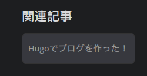

この記事ではPaperModで関連コンテンツを表示する方法について解説します！  
このブログではテーマに[PaperMod](https://github.com/adityatelange/hugo-PaperMod)を使用しています。  
しかし、PaperModでは関連記事を表示することができません。  
そこで今回はHugoのテンプレート機能を使って関連記事を表示させてみました！

## やり方

まずは関連記事を表示させるテンプレート本体を作っていきます。  
そのテンプレート本体をシングルページから呼び出して関連記事を表示します。  
PaperModに用意されていないかと調べていたらこんなものを見つけました。  

**[Show related posts | GitHub.com](https://github.com/adityatelange/hugo-PaperMod/pull/1049)**  

しかしこのプルリクエストは作成から4か月経った今でもマージされていません。  
仕方ないのでHugoのテンプレート機能を使ってこの機能を取り入れましょう。  

## テンプレートを作成する

### 関連記事のテンプレート

`layouts/partials/related.html` を作成します。  
そして次のコードをコピーして貼り付けてください。

```html
{{/*  Show related posts | Thanks: https://github.com/adityatelange/hugo-PaperMod/pull/1049  */}}

{{ $related := first 4 (where (where .Site.Pages ".Params.tags" "intersect" .Params.tags) "Permalink" "!=" .Permalink) }}
{{ with $related }}
  <div class="related">
    <h3 class="see-also">関連記事</h3>
    <ul>
      {{ range . }}
        <li>
          <a href="{{ .RelPermalink }}">{{ .Title }}</a>
        </li>
      {{ end }}
    </ul>
  </div>
{{ end }}
```

コードの内容についてはいつか追記したいと思います。  
とりあえず、これで関連記事のテンプレートは作成できました。  
次はこの関連記事のテンプレートを呼び出していきましょう。

### テンプレートの呼び出し

`themes/PaperMod/layouts/_default/single.html` を `layouts/_default/single.html` にコピーしてください。  
コピーしたら38行目に

```html{linenostart=38}
<footer class="post-footer">
```

と書かれていると思います。  
この下にテンプレートを呼び出すコードを書いていきます。  
次のコードをコピーして38行目の下に貼り付けてください。  

```html
{{/*  Show related posts | Thanks: https://github.com/adityatelange/hugo-PaperMod/pull/1049  */}}
{{- if (.Param "ShowRelatedContent") }}
    {{- partial "related.html" . }}
{{- end }}
```

これでテンプレートを呼び出すコードは終わりです。  

### 関連記事の表示を有効にする

`config.yml` や `hugo.yml` などの設定ファイルに次のコードを貼り付けてください。
自分の設定ファイルのフォーマットと同じ構成で書いてください。  

YAML:

```yaml
params:
  ShowRelatedContent: true
```

TOML:

```toml
[params]
ShowRelatedContent = true
```

JSON:

```json
{
  "params": {
    "ShowRelatedContent": true
  }
}
```

### CSSを適用する

これだけでも一応は機能しますが、見た目が最悪なのでCSSを書いていきます。  
オリジナルのプルリクエストにもCSSがありましたが、あまり好みではなかったため書き直しています。  

`assets/css/extended/custom.css` を作成してください。  
ここに作成したCSSは1つのファイルにまとめられます。([詳細](https://github.com/adityatelange/hugo-PaperMod/wiki/FAQs#bundling-custom-css-with-themes-assets))  
次のコードをコピーして貼り付けてください。  

```css
/* 関連記事 親要素 */
.post-footer .related {
    margin: 0;
    padding: 0;
}

/* "関連記事" */
.post-footer h3 {
    margin: 1.5em 0 0.8em 0;
}

/* リスト 親要素 */
.post-footer .related ul {
    margin: 0;
    padding: 0;
    list-style: none;
}

/* リスト アイテム */
.post-footer .related li {
    display: inline-block;
    margin-inline-end: 6px;
    margin-bottom: 6px;
}

/* リスト アイテム リンク */
.post-footer .related a {
    border-radius: var(--radius);
    background: var(--code-bg);
    border: 1px solid var(--border);
    display: block;
    padding: 8px 10px 8px 10px;
    color: var(--secondary);
    font-size: 15px;
    line-height: 34px;
    background: var(--code-bg);
}

/* リスト アイテム リンク ホバー */
.post-footer .related a:hover {
    background: var(--border);
}

/* 次/前のページとタグとの間をあける*/
.paginav {
    margin-top: 1.5em;
}
```

これでCSSは終了です。  
ですが、もうひと工夫を加えてより美しくしてみましょう。  
次のコードを追加してください。  

```css
/* 記事とフッタの間に線を入れる */
.post-footer {
    border-top: 1px solid;
    border-image: linear-gradient(90deg, var(--code-bg), var(--primary), var(--code-bg)) 1;
}
```

こうすることで記事本体とフッターの間にいい感じの線を入れられます。  
このブログでも使用しているので後で確認してみてください。  

## 完成

完成すると次のように表示されていると思います。  
関連記事がないと表示されないので注意してください。  

  

また、関連記事は4つまで表示されます。  
お疲れ様でした！  

## おわりに

今回はHugoのテンプレート機能を使ってPaperModで関連記事を表示させてみました。  
その他にもテンプレート機能を使うことでさまざまなことができます。  
このブログでは [PaperModでページネーションをカスタムする方法！](/posts/papermod-custom-pagination/) という記事も投稿しているのでこちらもぜひご覧ください！  
最後まで読んでいただきありがとうございました。  
