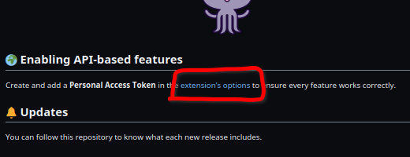
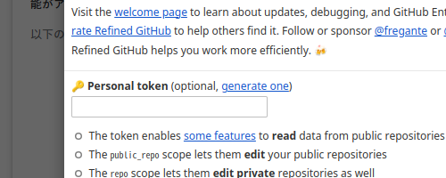
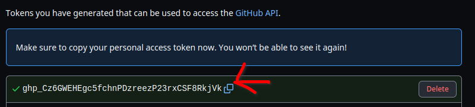

こんにちは！皆さんは普段GitHubを利用していますか？  
僕はこのブログを書いたり、新しいプロジェクトを探すために毎日利用しています！  
そんなGitHubですが、使っていくうちに不便だと感じるところが出てきませんか？  
今回紹介する "Refined GitHub" は、そんなちょっとした不便を解消してくれる拡張機能となっています！  
この拡張機能、なんと 2023年 2月 21日 時点で209個もの機能が実装されているんです！  
ぜひこの記事を読んでインストールしてみてください！  

## インストール方法

Refined GitHubは Chrome, Firefox, Safari に対応しています。  
ブラウザにRefined GitHubをインストールするには、各ブラウザのストアから入手する必要があります。  

### Chrome

**[Chrome用インストールリンク](https://chrome.google.com/webstore/detail/refined-github/hlepfoohegkhhmjieoechaddaejaokhf)** をクリックしてください。  

次に、 "Chrome に追加" と書かれた青いボタンを押してください。  
すると  

`次の権限にアクセス可能:`  
`api.github.com、gist.github.com、github.com 上にある自分のデータの読み取りと変更`

と出てきます。  
これは拡張機能を動作させるために必要な権限なので心配する必要はないです。  
"拡張機能を追加" と書かれたボタンを押してください。  
拡張機能が追加されると拡張機能の紹介ページが開きます。  

この後説明する **"APIベースの機能の有効化"** への設定リンクが書かれているため、そちらを利用する人はそのままにしておいてください。  
閉じてしまっても拡張機能の設定ページから開くことができるので大丈夫です。  

### Firefox

**[Firefox用インストールリンク](https://addons.mozilla.org/ja/firefox/addon/refined-github-/)** をクリックしてください。  

次に、 "Firefox へ追加" と書かれた青いボタンを押してください。  
すると  

`Refined GitHub を追加しますか？ この拡張機能は以下の権限が必要です:`  
`・github.com の保存されたデータへのアクセス`  
`・api.github.com の保存されたデータへのアクセス`  
`・gist.github.com の保存されたデータへのアクセス`  

と出てきます。  
これは拡張機能を動作させるために必要な権限なので心配する必要はないです。  
"追加(A)" と書かれたボタンを押してください。  

拡張機能が追加されると拡張機能の紹介ページが開きます。  
この後説明する **"APIベースの機能の有効化"** への設定リンクが書かれているため、そちらを利用する人はそのままにしておいてください。  
閉じてしまっても拡張機能の設定ページから開くことができるので大丈夫です。  

### Safari

**[Safari用インストールリンク](https://apps.apple.com/app/id1519867270)**  
Safari は僕がApple製品を所持していないためわかりません。ごめんなさい。

## APIベースの機能の有効化

これだけでもRefined GitHubは動作します。  
しかし、すべてを動作させるためには個人用アクセストークンの追加が必要です。  
個人用アクセストークンを追加すると次の機能が使えるようになります。  

* 公開リポジトリを編集できる (public_repo 権限)
* プライベートリポジトリも編集できる (repository 権限)
* クイックレポ削除が使える (delete_repo 権限)

### 個人用アクセストークンの追加方法

> **ここからはChromiumでの画像を載せていきます。Firefoxでも大体同じです**

拡張機能インストール後に表示された紹介ページでオクトキャットの下の  
`Create and add a Personal Access Token in the extension’s options to ensure every feature works correctly.`  
の `extension’s options` がクリックできるのでクリックしてください。  
  

閉じてしまった人は  
Chrome: `右上3点マーク > その他のツール > 拡張機能 > Refined GitHub 詳細 > 拡張機能のオプション`  
Firefox: `右上3本線 > アドオンとテーマ > 拡張機能 > Refined GitHub > 設定`  
で開けます

すると拡張機能の設定ページが開きます。  
そこで `🔑 Personal token (optional, generate one)` と書かれているところがあります。  
`generate one` がクリックできるのでクリックしてください。  
  

クリックすると、GitHubに飛び、パスワードを求められます。  
パスワードを入力すると個人用アクセストークンの生成ページが表示されます。  
(旧式のアクセストークンだと気づいた人もいると思います。そのうち Refined GitHub で更新がされると思います。)  

設定は基本そのままで大丈夫ですが、`Expiration`が30日に設定されているため30日で有効期限が切れてしまいます。  
無期限にも設定できますが、その場合はセキュリティとトレードオフです。  
自分で好きな期限を設定してください。  

下のほうに緑色で `Generate token` とあります。クリックしましょう。  
クリックするとページが移動します。  
ページが移動したら、個人用アクセストークンが表示されているのでコピーします。  

**1度しか表示されないのでコピーし忘れないように注意してください。**

  
(ちなみにこのトークンは無効です。)  

コピーしたらさっきの拡張機能の設定ページに戻ります。  
そして `🔑 Personal token (optional, generate one)` の下のテキストボックスに貼り付けます。  
トークンが有効だった場合、その下のテキストが

`☑ The token enables some features to read data from public repositories`  
`☑ The public_repo scope lets them edit your public repositories`  
`☑ The repo scope lets them edit private repositories as well`  
`☑ The delete_repo scope is only used by the quick-repo-deletion feature`  

となります。  
チェックマークが出れば個人用アクセストークンの認証は完了です。  

## 機能

正直多すぎて紹介しきれません。  
代表的な機能は

* 空白文字が見えるようになる
* 1クリックのコンフリクト修正プログラムの追加
* コメントにリアクションした人のアイコンを表示
* IssueやPRなどを除くすべてのイベントを非表示にできる
* コードや会話のタイトルでIssueやPRの参照元やURLをリンクさせる
* PRのマージ時にチェックを待つオプションの追加
* PR内の全ファイルの変更を元に戻すボタンを追加
* タイプとステータスで通知を選択できる

があります。  
この拡張機能をインストールした時点で気づいた人もいると思いますが、GitHub内のさまざまなUIが変更されています。  
この拡張機能は "シンプルさ" を目的にしているので細かい設定等は必要ありません。  
すべての機能を確認したい人はRefined GitHubのREADMEを確認してみてください。  

## おわりに

今回はGitHubの機能を強化する拡張機能 'Refined GitHub' を紹介しました。  
Refined GitHubから本家に輸入されているデザインもあるそうです。  
今後の動向が見逃せない拡張機能ですね！  
最後まで読んでいただきありがとうございました。  
